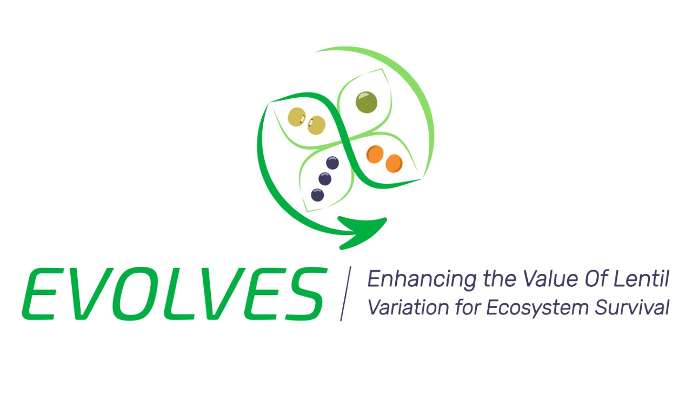

```{r setup, include=FALSE}
knitr::opts_chunk$set(echo = TRUE, message = F, warning = F, comment = NA, out.width = "100%")
```

\pagebreak

---

[Derek M Wright, Sandesh Neupane & Kirstin E. Bett. **NAM**. (2023) unpublished.](https://github.com/derekmichaelwright/) 

---

https://github.com/derekmichaelwright/EVOLVES_NAM

[View as pdf](https://github.com/derekmichaelwright/EVOLVES_NAM/raw/master/README.pdf)

[View as HTML](https://derekmichaelwright.github.io/EVOLVES_NAM/README.html)

[Source Code Vignette (GWAS_Phenology_Vignette.html)](https://derekmichaelwright.github.io/EVOLVES_NAM/NAM_Vignette.html)

# Contents

- [Figures](#figures)
- [Supplemental Tables](#supplemental-tables)
- [Supplemental Figures](#supplemental-figures)
- [Additional Figures](#additional-figures)

# AGILE & P2IRC Projects



\pagebreak

## Collaborators

- Department of Plant Sciences and Crop Development Centre, University of Saskatchewan, Saskatoon, Saskatchewan, Canada

---

# Figures

## Figure 01


*Figure 1: *

---

## Figure 02


*Figure 2: *

---

# Supplemental Tables

## Supplemental Table 1

[Supplemental_Table_01.csv](https://github.com/derekmichaelwright/EVOLVES_NAM/blob/master/Supplemental_Table_01.csv)

```{r echo = F, eval = F}
DT::datatable(read.csv("Supplemental_Table_01.csv"))
```

*Supplemental Table 1: *

---

# Supplemental Figures

## Supplemental Figure 01


*Supplemental Figure 1: *

---

## Supplemental Figure 02


*Supplemental Figure 2: *

---

# Additional Figures

## Additional Figure 01


---

&copy; Derek Michael Wright
